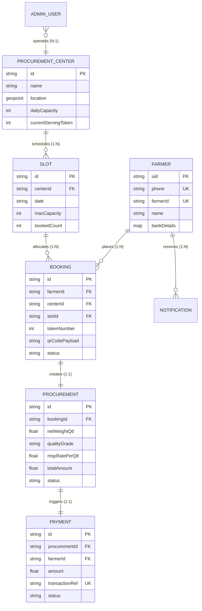

# 🌾 Mandi Mitra — Backend Data Architecture & Firestore Database Design
**Tech Stack**: Node.js + Express.js • Firebase Firestore • Firebase Authentication

---

## 1. User Flow & Data Ingestion Analysis

By analyzing every screen of the **Mandi Mitra** frontend, we identify the exact data points collected, queried, mutated, and transitioned across lifecycles:

```mermaid
graph TD
    subgraph "1. Onboarding & Auth (/login, /register)"
        UF1["Farmer Enters Mobile / Aadhaar / Kisan ID"] --> UF2["Phone Auth OTP Verification via Firebase Auth"]
        UF2 --> UF3["Create / Link Farmer Record in 'farmers' Collection"]
    end

    subgraph "2. Discovery & Selection (/centers)"
        UF4["Search Centers by District / Crop Type"] --> UF5["Query 'procurement_centers' with Real-Time Capacity & Crowd Status"]
        UF5 --> UF6["Select Center & View Available Schedules ('schedules' / 'slots')"]
    end

    subgraph "3. Booking Appointment (/centers/[id])"
        UF7["Pick Crop, Quantity, Date & Time Slot"] --> UF8["Atomic Transaction: Increment bookedCount in 'slots'"]
        UF8 --> UF9["Create 'bookings' Record + Generate Token Number & QR Code String"]
        UF9 --> UF10["Create Initial 'procurements' Record (status: 'slot-confirmed')"]
        UF10 --> UF11["Dispatch In-App / SMS Confirmation ('notifications')"]
    end

    subgraph "4. Center Arrival & Processing (/admin, /queue)"
        UF12["Farmer Check-in at Gate via QR Scan"] --> UF13["Admin Calls Next Token: 'in-progress'"]
        UF13 --> UF14["Quality Inspection (Moisture % & Grade A/B/C) Recorded"]
        UF14 --> UF15["Weighbridge Net Weight Recorded in 'procurements'"]
        UF15 --> UF16["Procurement Accepted -> Mandi Parchi Generated"]
    end

    subgraph "5. Settlement & Feedback (/payments, /history)"
        UF17["Procurement Completed Triggers DBT 'payments' Record"]
        UF17 --> UF18["Farmer Tracks Status in Real-Time /queue & /payments"]
        UF18 --> UF19["Download Certified Parchi Receipt (PDF Data)"]
    end
```



---

## 2. Firestore Database Schema Design

In Cloud Firestore, we balance **document normalization** (for data integrity) with **strategic denormalization** (to eliminate expensive join reads on low-bandwidth rural mobile connections).

### Collection Architecture Overview

| Collection | Path | Primary Role |
|---|---|---|
| `farmers` | `/farmers/{farmerId}` | Farmer identity, demographic, land/Kisan ID, and bank details |
| `procurement_centers` | `/procurement_centers/{centerId}` | Center details, daily capacity, geo-coordinates, live queue state |
| `schedules` | `/procurement_centers/{centerId}/schedules/{scheduleId}` | Seasonal procurement active date ranges per crop |
| `slots` | `/slots/{slotId}` | Granular 90-minute time intervals with capacity counters |
| `bookings` | `/bookings/{bookingId}` | Reserved appointment ticket with token number & QR code payload |
| `procurements` | `/procurements/{procurementId}` | Physical procurement lifecycle (quality grade, net weight, Mandi Parchi) |
| `payments` | `/payments/{paymentId}` | DBT financial records, bank transaction reference, disbursement status |
| `notifications` | `/farmers/{farmerId}/notifications/{notificationId}` | Subcollection for farmer-specific alerts and SMS logs |
| `admin_users` | `/admin_users/{adminId}` | Mandi officials, weighbridge operators, quality inspectors |
| `analytics_daily` | `/procurement_centers/{centerId}/analytics_daily/{date}` | Aggregated daily totals for charts and AI crowd surge predictions |

---

### Collection 1: `farmers`
- **Document ID**: Firebase Auth UID (`auth.uid`)
- **Description**: Profile, verified identifiers, bank DBT account details, and preferred language.

| Field Name | Type | Validation / Constraints | Description / Example |
|---|---|---|---|
| `uid` | string | Required, matches Auth UID | Unique Firebase Auth ID |
| `name` | string | Required, 2-100 chars | Farmer's full name ("Ramesh Kumar") |
| `nameHi` | string | Optional | Hindi localized name ("रमेश कुमार") |
| `phone` | string | Required, E.164 (`+91XXXXXXXXXX`) | Primary mobile number |
| `aadhaarLast4` | string | Required, exactly 4 digits | Masked Aadhaar identifier ("4521") |
| `aadhaarHash` | string | Optional, SHA-256 string | One-way cryptographic hash for duplicate fraud check |
| `farmerId` | string | Required, unique index | Official Kisan Registration ID ("MP-KISAN-4521") |
| `village` | string | Required, 2-80 chars | Village name ("Jatpura") |
| `villageHi` | string | Optional | Village name in Hindi ("जाटपुरा") |
| `district` | string | Required | District name ("Bhopal") |
| `districtHi` | string | Optional | District name in Hindi ("भोपाल") |
| `state` | string | Required | State ("Madhya Pradesh") |
| `pincode` | string | Required, 6 digits | Area postal code ("462001") |
| `bankDetails` | map | Required | Nested bank account object |
| `bankDetails.bankName` | string | Required | Bank Name ("State Bank of India") |
| `bankDetails.accountNumberMasked` | string | Required | Masked account ("••••••••7890") |
| `bankDetails.accountHash` | string | Required | Hash of full account number for DBT routing |
| `bankDetails.ifsc` | string | Required, 11 uppercase chars | IFSC code ("SBIN0001234") |
| `languagePreference` | string | Enum: `'en'` \| `'hi'` | Default UI & SMS language |
| `photoUrl` | string | URL string | Farmer profile photo URL |
| `isActive` | boolean | Default: `true` | Account state flag |
| `createdAt` | timestamp | ServerTimestamp | Registration timestamp |
| `updatedAt` | timestamp | ServerTimestamp | Last profile update timestamp |

---

### Collection 2: `procurement_centers`
- **Document ID**: Auto-generated or slugs (`bhopal-central-mandi`)
- **Description**: Physical mandis, location coordinates, operational capacity, and real-time crowd indicators.

| Field Name | Type | Validation / Constraints | Description / Example |
|---|---|---|---|
| `id` | string | Required | Center identifier ("c1") |
| `name` | string | Required | Center name ("Bhopal Central Mandi") |
| `nameHi` | string | Required | Center name in Hindi ("भोपाल सेंट्रल मंडी") |
| `address` | string | Required | Physical street address |
| `addressHi` | string | Required | Address in Hindi |
| `district` | string | Required, indexed | District ("Bhopal") |
| `state` | string | Required | State ("Madhya Pradesh") |
| `location` | geopoint | Required | `GeoPoint(23.2599, 77.4126)` for distance calculations |
| `dailyCapacity` | number | Int > 0 | Maximum farmers handled per day (e.g. 200) |
| `operatingHours` | string | Required | Formatted timings ("8:00 AM - 5:00 PM") |
| `operatingHoursHi` | string | Required | Timings in Hindi ("सुबह 8:00 - शाम 5:00") |
| `cropsAccepted` | array of strings | Non-empty array | `['wheat', 'chana', 'mustard', 'soybean']` |
| `status` | string | Enum: `'open'` \| `'closed'` \| `'maintenance'` | Mandi operating state |
| `currentServingToken` | number | Int >= 0 | Currently processed token (e.g. 78) |
| `currentQueueCount` | number | Int >= 0 | Real-time waiting count (e.g. 22) |
| `todayArrivedCount` | number | Int >= 0 | Gate verified arrivals today |
| `todayProcessedCount`| number | Int >= 0 | Fully weighed/certified today |
| `avgProcessingTimeMin`| number | Float >= 0 | Rolling average processing time (e.g. 18.5 min) |
| `crowdLevel` | string | Enum: `'low'` \| `'moderate'` \| `'high'` | Computed dynamic indicator |
| `contactPhone` | string | Valid phone format | Office landline / helpline number |
| `updatedAt` | timestamp | ServerTimestamp | Last queue heartbeat update |

---

### Collection 3: `slots`
- **Document ID**: Structured format (`{centerId}_{date}_{startTime}`) e.g. `c1_2026-09-08_1100`
- **Description**: Finite appointment slots preventing overcrowding.

| Field Name | Type | Validation / Constraints | Description / Example |
|---|---|---|---|
| `id` | string | Required, unique | Slot identifier |
| `centerId` | string | Required, indexed | Reference to `procurement_centers` |
| `date` | string | ISO Date (`YYYY-MM-DD`) | Appointment date ("2026-09-08") |
| `startTime` | string | Time format (`HH:mm`) | "11:00" |
| `endTime` | string | Time format (`HH:mm`) | "12:30" |
| `period` | string | Enum: `'morning'` \| `'afternoon'` \| `'evening'` | Time of day bracket |
| `maxCapacity` | number | Int > 0 | Max slots allotted (e.g. 35) |
| `bookedCount` | number | Int >= 0, `<= maxCapacity` | Current bookings counter |
| `status` | string | Enum: `'available'` \| `'full'` \| `'cancelled'` | Live availability status |
| `createdAt` | timestamp | ServerTimestamp | Slot creation timestamp |

---

### Collection 4: `bookings`
- **Document ID**: Auto-generated UID
- **Description**: The core appointment ticket connecting the farmer, slot, center, and crop type.

| Field Name | Type | Validation / Constraints | Description / Example |
|---|---|---|---|
| `id` | string | Required | Unique booking ID |
| `bookingRef` | string | Unique, human-readable | "BK-20260908-0083" |
| `farmerId` | string | Required, indexed | Reference to `farmers` UID |
| `farmerName` | string | Denormalized | "Ramesh Kumar" (avoids extra read) |
| `farmerPhone` | string | Denormalized | "+919876543210" |
| `centerId` | string | Required, indexed | Reference to `procurement_centers` |
| `centerName` | string | Denormalized | "Bhopal Central Mandi" |
| `slotId` | string | Required, indexed | Reference to `slots` |
| `date` | string | ISO Date (`YYYY-MM-DD`) | "2026-09-08" |
| `slotTime` | string | Denormalized | "11:00 - 12:30" |
| `tokenNumber` | number | Int > 0, unique per center/date | 83 |
| `qrCodePayload` | string | Unique string | "MM-TKN-83-c1-20260908" |
| `cropType` | string | Valid crop enum | "wheat" |
| `estimatedQuantityQtl`| number | Float > 0 | Farmer declared estimate (e.g. 52.0) |
| `status` | string | Enum: `'confirmed'` \| `'arrived'` \| `'in-progress'` \| `'completed'` \| `'cancelled'` \| `'no-show'` | Current appointment state |
| `arrivedAt` | timestamp | Nullable | Gate QR scan check-in time |
| `createdAt` | timestamp | ServerTimestamp | Booking submission time |
| `updatedAt` | timestamp | ServerTimestamp | Last state transition time |

---

### Collection 5: `procurements`
- **Document ID**: Auto-generated or formatted (`PROC-{bookingRef}`)
- **Description**: The physical inspection, weighbridge measurement, and government certification record (Mandi Parchi).

| Field Name | Type | Validation / Constraints | Description / Example |
|---|---|---|---|
| `id` | string | Required | Procurement ID |
| `parchiNumber` | string | Unique official receipt no. | "MP-PARCHI-2026-8301" |
| `bookingId` | string | Required, unique, indexed | Reference to `bookings` |
| `farmerId` | string | Required, indexed | Reference to `farmers` |
| `centerId` | string | Required, indexed | Reference to `procurement_centers` |
| `cropType` | string | Required | "wheat" |
| `grossWeightQtl` | number | Float >= 0 | Vehicle + harvest weight |
| `tareWeightQtl` | number | Float >= 0 | Empty vehicle weight |
| `netWeightQtl` | number | Float > 0 | Net harvested weight (e.g. 52.4) |
| `qualityGrade` | string | Enum: `'A'` \| `'B'` \| `'C'` \| `'REJECTED'` | Official grade |
| `moisturePercent` | number | Float between 0-30% | Moisture test reading (e.g. 11.2%) |
| `foreignMatterPercent`| number| Float >= 0 | Dirt/chaff percentage (e.g. 0.8%) |
| `mspRatePerQtl` | number | Float > 0 | Official price per quintal (₹2,275) |
| `totalAmount` | number | `netWeightQtl * mspRatePerQtl` | ₹1,19,210.00 |
| `status` | string | Enum: `'slot-confirmed'` \| `'arrived'` \| `'quality-check'` \| `'weighing'` \| `'accepted'` \| `'rejected'` \| `'payment-processing'` \| `'payment-completed'` | 8-stage progress tracker state |
| `inspectorId` | string | Nullable | Reference to official `admin_users` |
| `weighbridgeOperatorId`| string| Nullable | Reference to weighbridge operator |
| `rejectionReason` | string | Nullable | Required if status is `'rejected'` |
| `parchiPdfUrl` | string | Nullable URL | Generated digital PDF receipt URL |
| `createdAt` | timestamp | ServerTimestamp | Initial record creation |
| `completedAt` | timestamp | Nullable | Final weigh & acceptance time |

---

### Collection 6: `payments`
- **Document ID**: Auto-generated UID
- **Description**: Government Direct Benefit Transfer (DBT) transactions and PFMS gateway references.

| Field Name | Type | Validation / Constraints | Description / Example |
|---|---|---|---|
| `id` | string | Required | Payment record ID |
| `procurementId` | string | Required, unique, indexed | Reference to `procurements` |
| `farmerId` | string | Required, indexed | Reference to `farmers` |
| `amount` | number | Float > 0 | Exact amount in INR (₹1,19,210.00) |
| `paymentMode` | string | Enum: `'DBT-NEFT'` \| `'RTGS'` \| `'PFMS-DIRECT'` | Bank settlement mechanism |
| `transactionRef` | string | Unique bank UTR / Ref | "NEFT20260909SBI7890" |
| `bankName` | string | Denormalized | "State Bank of India" |
| `accountLast4` | string | Denormalized | "7890" |
| `status` | string | Enum: `'pending'` \| `'processing'` \| `'completed'` \| `'failed'` | Payment state |
| `failureReason` | string | Nullable | E.g. "Aadhaar bank link invalid" |
| `initiatedAt` | timestamp | ServerTimestamp | Bank gateway dispatch time |
| `processedAt` | timestamp | Nullable | Verified bank credit time |

---

### Collection 7: `farmers/{farmerId}/notifications`
- **Path**: Subcollection under specific farmer
- **Description**: Real-time push alerts and simulated/actual SMS notification logs.

| Field Name | Type | Validation / Constraints | Description / Example |
|---|---|---|---|
| `id` | string | Required | Notification ID |
| `title` | string | Required | "Slot Confirmed" |
| `titleHi` | string | Required | "स्लॉट पुष्ट" |
| `message` | string | Required | English text message |
| `messageHi` | string | Required | Hindi text message |
| `type` | string | Enum: `'info'` \| `'success'` \| `'warning'` \| `'urgent'` | Category badge |
| `channel` | string | Enum: `'in-app'` \| `'sms'` \| `'both'` | Delivery medium |
| `read` | boolean | Default: `false` | Read status |
| `metadata` | map | Optional | `{ bookingId, tokenNumber, centerId }` |
| `createdAt` | timestamp | ServerTimestamp | Dispatch time |

---

### Collection 8: `admin_users`
- **Document ID**: Firebase Auth UID (`auth.uid`)
- **Description**: Authorized procurement center officials, graders, and admins.

| Field Name | Type | Validation / Constraints | Description / Example |
|---|---|---|---|
| `uid` | string | Required | Auth UID |
| `name` | string | Required | Official's name |
| `email` | string | Required | Official gov email |
| `role` | string | Enum: `'super_admin'` \| `'center_manager'` \| `'quality_inspector'` \| `'weighbridge_operator'` | Role-based access control |
| `assignedCenterId` | string | Required for center staff | Reference to `procurement_centers` |
| `isActive` | boolean | Default: `true` | Access activation flag |
| `createdAt` | timestamp | ServerTimestamp | Account creation date |

---

## 3. Entity-Relationship & State Machine



---

## 4. Firestore Security Rules

These rules enforce strict Role-Based Access Control (RBAC), ensure data ownership validation, and prevent tampering with tokens or financial figures:

```javascript
rules_version = '2';
service cloud.firestore {
  match /databases/{database}/documents {

    // Helper functions
    function isAuthenticated() {
      return request.auth != null;
    }
    
    function isOwner(userId) {
      return isAuthenticated() && request.auth.uid == userId;
    }

    function isAdmin() {
      return isAuthenticated() && 
        exists(/databases/$(database)/documents/admin_users/$(request.auth.uid)) &&
        get(/databases/$(database)/documents/admin_users/$(request.auth.uid)).data.isActive == true;
    }

    function isCenterStaff(centerId) {
      return isAdmin() && (
        get(/databases/$(database)/documents/admin_users/$(request.auth.uid)).data.role == 'super_admin' ||
        get(/databases/$(database)/documents/admin_users/$(request.auth.uid)).data.assignedCenterId == centerId
      );
    }

    // Farmers: Can read and update their own document only
    match /farmers/{farmerId} {
      allow read: if isOwner(farmerId) || isAdmin();
      allow create: if isOwner(farmerId);
      allow update: if isOwner(farmerId) && !request.resource.data.diff(resource.data).affectedKeys().hasAny(['farmerId', 'aadhaarLast4', 'uid']);
      allow delete: if false;

      // Notifications subcollection
      match /notifications/{notificationId} {
        allow read, update: if isOwner(farmerId);
        allow create, delete: if isAdmin();
      }
    }

    // Procurement Centers: Publicly readable; writable only by assigned staff/admins
    match /procurement_centers/{centerId} {
      allow read: if true;
      allow write: if isCenterStaff(centerId);
    }

    // Slots: Publicly readable; mutations handled by cloud functions/backend
    match /slots/{slotId} {
      allow read: if true;
      allow write: if isAdmin();
    }

    // Bookings: Farmers can view their own; creation validated; staff can update status
    match /bookings/{bookingId} {
      allow read: if isAuthenticated() && (
        resource.data.farmerId == request.auth.uid || isAdmin()
      );
      allow create: if isAuthenticated() && request.resource.data.farmerId == request.auth.uid;
      allow update: if isCenterStaff(resource.data.centerId) || (
        isOwner(resource.data.farmerId) && 
        request.resource.data.diff(resource.data).affectedKeys().hasOnly(['status']) &&
        request.resource.data.status == 'cancelled'
      );
      allow delete: if false;
    }

    // Procurements: Farmer can view their own records; only certified staff can grade & weigh
    match /procurements/{procurementId} {
      allow read: if isAuthenticated() && (
        resource.data.farmerId == request.auth.uid || isAdmin()
      );
      allow write: if isAdmin();
    }

    // Payments: Farmer can view their own; only backend/admin can write
    match /payments/{paymentId} {
      allow read: if isAuthenticated() && (
        resource.data.farmerId == request.auth.uid || isAdmin()
      );
      allow write: if isAdmin();
    }

    // Admin Users: Only viewable by authenticated admins
    match /admin_users/{adminId} {
      allow read: if isAdmin();
      allow write: if isAuthenticated() && 
        get(/databases/$(database)/documents/admin_users/$(request.auth.uid)).data.role == 'super_admin';
    }
  }
}
```

---

## 5. REST API Specifications (Node.js + Express)

All authenticated endpoints verify the Firebase Bearer token via `firebase-admin.auth().verifyIdToken(token)`.

### A. Authentication & Profile
| Endpoint | Method | Auth | Body / Params | Screen Mapping | Description |
|---|---|---|---|---|---|
| `/api/v1/auth/verify-otp` | `POST` | Public | `{ phone, otp, method, name, village, district }` | `/login` | Validates OTP, creates/retrieves `farmers` doc, returns JWT & session token |
| `/api/v1/farmers/me` | `GET` | Farmer | Headers: `Bearer <token>` | `/dashboard` | Returns logged-in farmer profile and summary counts |
| `/api/v1/farmers/me` | `PUT` | Farmer | `{ name, village, district, languagePreference }` | Profile Modal | Updates non-critical demographic details |

### B. Centers & Live Telemetry
| Endpoint | Method | Auth | Body / Params | Screen Mapping | Description |
|---|---|---|---|---|---|
| `/api/v1/centers` | `GET` | Public | Query: `?district=&crop=&crowd=` | `/centers` | Lists active centers with real-time crowd tags and wait times |
| `/api/v1/centers/:id` | `GET` | Public | Params: `id` | `/centers/[id]` | Center profile, operating hours, and daily capacity stats |
| `/api/v1/centers/:id/slots` | `GET` | Public | Query: `?date=YYYY-MM-DD` | `/centers/[id]` | Real-time availability for morning, afternoon, and evening slots |
| `/api/v1/centers/:id/recommendation` | `GET` | Public | Query: `?lat=&lng=&crop=` | `/centers` | Algorithmically suggests the least crowded nearby center |

### C. Booking & Queue Management
| Endpoint | Method | Auth | Body / Params | Screen Mapping | Description |
|---|---|---|---|---|---|
| `/api/v1/bookings` | `POST` | Farmer | `{ centerId, slotId, date, cropType, estimatedQuantity }` | `/centers/[id]` | Atomic slot capacity decrement + Token & Mandi Parchi QR generation |
| `/api/v1/bookings/active` | `GET` | Farmer | Headers: `Bearer <token>` | `/dashboard`, `/queue` | Retrieves the farmer's current active booking and queue position |
| `/api/v1/queue/live/:centerId` | `GET` | Public | Params: `centerId` | `/queue` | Live serving token, queue length, and rolling wait estimate |
| `/api/v1/bookings/:id/cancel` | `POST` | Farmer | Params: `id` | `/dashboard` | Releases booked slot back to pool and marks ticket cancelled |

### D. Procurement Lifecycle & Mandi Parchi (Officer & Farmer)
| Endpoint | Method | Auth | Body / Params | Screen Mapping | Description |
|---|---|---|---|---|---|
| `/api/v1/procurements/status/:bookingId` | `GET` | Farmer | Params: `bookingId` | `/queue` | Fetches the 8-stage progress tracker state and timestamps |
| `/api/v1/procurements/history` | `GET` | Farmer | Headers: `Bearer <token>` | `/history` | Historical accepted records, grades, certified weights, and slips |
| `/api/v1/procurements/:id/parchi` | `GET` | Farmer | Params: `id` | `/history` | Generates / downloads signed official Mandi Parchi PDF data |

### E. Financial Disbursements (DBT)
| Endpoint | Method | Auth | Body / Params | Screen Mapping | Description |
|---|---|---|---|---|---|
| `/api/v1/payments/my-payments` | `GET` | Farmer | Headers: `Bearer <token>` | `/payments` | Financial ledger with UTR numbers, status, and bank credit details |

### F. Admin Console Endpoints
| Endpoint | Method | Auth | Body / Params | Screen Mapping | Description |
|---|---|---|---|---|---|
| `/api/v1/admin/queue/:centerId` | `GET` | Admin | Params: `centerId` | `/admin` | Real-time roster of today's waiting, in-progress, and processed tokens |
| `/api/v1/admin/queue/call-next` | `POST` | Admin | `{ centerId }` | `/admin` | Advances token number, triggers SMS alert to next 5 queued farmers |
| `/api/v1/admin/procurements/weigh` | `POST` | Admin | `{ bookingId, grossWeight, tareWeight, qualityGrade, moisture }` | `/admin` | Finalizes electronic weighbridge measurement and creates Mandi Parchi |
| `/api/v1/admin/analytics/surge-prediction`| `GET`| Admin| Params: `centerId` | `/admin` | AI surge forecast data for tomorrow's hourly arrival distribution |

---

## 6. Firestore Indexing Strategy

To guarantee millisecond response times on compound queries without in-memory sorting:

| Collection | Fields Indexed | Query Scope | Purpose |
|---|---|---|---|
| `procurement_centers` | `district` (ASC) + `status` (ASC) | Collection | Filter centers by location & open state |
| `slots` | `centerId` (ASC) + `date` (ASC) + `startTime` (ASC) | Collection | Slot picker calendar for specific dates |
| `bookings` | `farmerId` (ASC) + `status` (ASC) + `createdAt` (DESC) | Collection | Farmer's active booking lookup |
| `bookings` | `centerId` (ASC) + `date` (ASC) + `tokenNumber` (ASC) | Collection | Admin queue ordering |
| `procurements` | `farmerId` (ASC) + `createdAt` (DESC) | Collection | Farmer history page ordering |
| `payments` | `farmerId` (ASC) + `status` (ASC) + `initiatedAt` (DESC) | Collection | Payments ledger display |
| `notifications` | `read` (ASC) + `createdAt` (DESC) | Subcollection | Unread alerts badge count |

---

## 7. Minimal Frontend Touchpoints (For Later Integration)

> [!NOTE]
> Per your instruction, **no existing frontend code was modified**. When we are ready to connect, these are the exact 4 integration points:
> 1. **`src/context/AuthContext.tsx`**: Replace the mock `localStorage` login function with `signInWithPhoneNumber` (Firebase Auth) or our Node API `/api/v1/auth/verify-otp`.
> 2. **`src/lib/api-client.ts`** *(New file)*: A simple `fetch` wrapper that includes the Firebase Bearer token in headers.
> 3. **Page Data Fetching**: Replace static arrays in `centers/page.tsx`, `dashboard/page.tsx`, and `queue/page.tsx` with standard `useEffect` or SWR calls targeting the endpoints listed above.
> 4. **Firebase SDK Config**: Add `firebaseConfig` credentials in `.env.local`.
